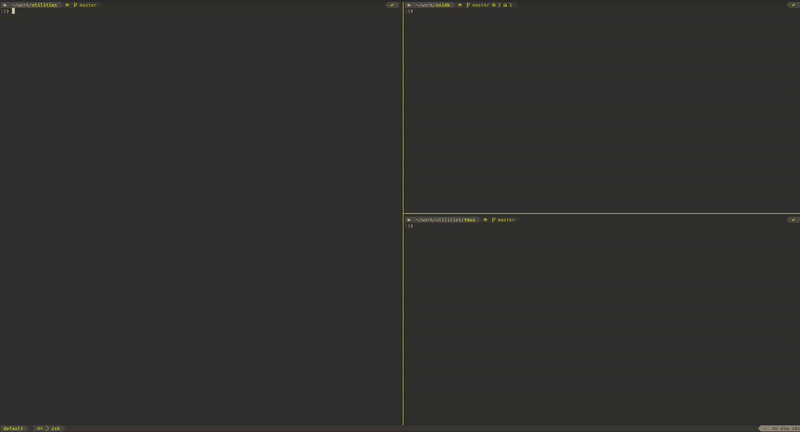

# Tmux AI CLI Plugin

<div align="center">
  
</div>

A tmux plugin for launching Claude Code and Gemini CLI sessions from within tmux using keyboard shortcuts. This plugin provides quick AI assistance without leaving your terminal workflow.

## Installation

### Using TPM (Tmux Plugin Manager)

Add this line to your `~/.tmux.conf`:

```bash
set -g @plugin 'JakubFrejlach/tmux-ai-cli'
```

Then press `prefix + I` to install the plugin.

### Manual Installation

1. Clone this repository:
   ```bash
   git clone https://github.com/JakubFrejlach/tmux-ai-cli.git ~/.tmux/plugins/tmux-ai-cli
   ```

2. Add this line to your `~/.tmux.conf`:
   ```bash
   run-shell ~/.tmux/plugins/tmux-ai-cli/tmux-ai-cli.tmux
   ```

3. Reload tmux configuration:
   ```bash
   tmux source-file ~/.tmux.conf
   ```

## Usage

Once installed, you can use these keyboard shortcuts from within any tmux session:

- **`prefix + u`** - Launch Claude Code in a popup window
- **`prefix + j`** - Launch Gemini CLI in a popup window

The popup will open at 80% width and 75% height, centered on your screen.

## Configuration

You can customize the key bindings and shell by setting these options in your `~/.tmux.conf`:

```bash
# Customize key bindings (defaults shown)
set -g @tmux_ai_claude_key 'u'
set -g @tmux_ai_gemini_key 'j'

# Customize shell (defaults to zsh)
set -g @tmux_ai_shell 'zsh'  # or 'bash'
```

## How It Works

### Session Management
- Each script creates a named tmux session (`{project}-claude` or `{project}-gemini`)
- Sessions are reused if they already exist (`tmux new-session -A`)
- Session names are automatically generated based on:
  - Git repository name (if in a git repo)
  - Current directory name (if not in a git repo)
- Long names are truncated to keep sessions manageable

### Directory Context
- The popup starts in the appropriate directory:
  - Git repository root (if current directory is in a git repo)
  - Current working directory (if not in a git repo)
- This ensures the AI tools have proper context of your project

### Shell Integration
- Scripts automatically detect your configured shell (bash or zsh)
- Sources the appropriate shell configuration:
  - `~/.bashrc` for bash
  - `~/.zshrc` for zsh (default)
- This ensures all your aliases, functions, and environment variables are available
- Requires `claude` and `gemini` commands to be available in your PATH

### Popup Behavior
- Popups are ephemeral - they disappear when you exit the AI tool
- The underlying tmux session persists, so you can reconnect later
- Sessions are shared across all popup instances from the same project

## Requirements

- `tmux` with popup support (version 3.2+)
- `claude` command available in PATH (Claude Code CLI)
- `gemini` command available in PATH (Gemini CLI)
- `git` (optional, for repository detection)